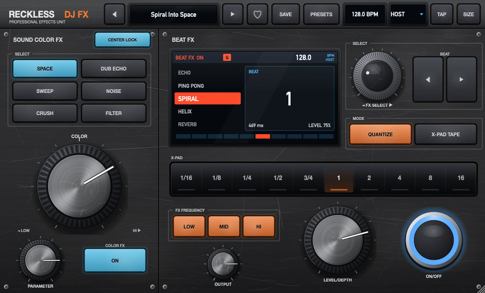

# Reckless DJ FX

Plugin d'effets **VST3 / AU** (macOS, + VST3 Windows via la CI) qui reprend toute la section effets d'une table de mixage DJ club 4 voies haut de gamme : les **14 Beat FX**, les **6 Sound Color FX** et toutes leurs commandes — dans une interface redimensionnable, avec **281 presets d'usine**, des presets utilisateur, des ❤️ likes et une **banque « Liked »**.



> *Inspiré du workflow effets de la Pioneer DJ DJM-A9. Projet indépendant, non affilié à Pioneer DJ / AlphaTheta. Les algorithmes sont des recréations originales, pas des copies.*

## Effets

### Beat FX (14)
| Effet | Ce qu'il fait | BEAT ◄► |
|---|---|---|
| **DELAY** | Répétition simple calée sur le tempo | 1/16 → 16 temps |
| **ECHO** | Écho à fort feedback, filtré, qui continue après l'arrêt (trail) | 1/16 → 16 |
| **PING PONG** | Échos qui rebondissent gauche ↔ droite | 1/16 → 16 |
| **SPIRAL** | Les échos se fondent en nappe de réverb et montent en hauteur à chaque répétition ; LEVEL/DEPTH règle aussi la durée de la spirale | 1/16 → 16 |
| **HELIX** | Boucle quasi infinie qui « tient » le son, glissements de pitch ; à LEVEL/DEPTH 100 % seul l'effet est audible | 1/16 → 16 |
| **REVERB** | Réverbération, le beat règle la taille (10 → 100 %) | 10 % → 100 % |
| **FLANGER** | Flanger dont le cycle suit le beat | 1/16 → 16 |
| **PHASER** | Phaser 6 étages synchronisé | 1/16 → 16 |
| **FILTER** | Balayage de filtre résonant synchronisé | 1/16 → 16 |
| **TRIPLET FILTER** | Impulsions de filtre sur une grille de triolets | 1/24 → 32/3 |
| **TRANS** | Coupe le son en rythme (gate) | 1/16 → 16 |
| **ROLL** | Capture et répète le son à la valeur choisie | 1/16 → 16 |
| **TRIPLET ROLL** | Roll en triolets | 1/24 → 32/3 |
| **MOBIUS** | Banque de filtres « Shepard » qui monte sans fin au rythme du beat | 1/16 → 16 |

### Sound Color FX (6)
**SPACE**, **DUB ECHO**, **SWEEP**, **NOISE**, **CRUSH**, **FILTER**. Elles se pilotent avec un potard **COLOR** bipolaire : gauche = grave/LPF, droite = aigu/HPF, centre = son sec. Un potard **PARAMETER** et un bouton **CENTER LOCK** complètent la section : le potard s'arrête au centre, et il faut le tourner d'environ 15 % de sa course pour en sortir. **CRUSH** sature le son puis le réduit en bits par compression mu-law, ce qui casse les fins de notes en grain comme sur la table.

### Commandes
- **BEAT ◄ ►** et **X-PAD**. Le X-Pad est momentané : tu touches une valeur, l'effet s'enclenche, et il se coupe quand tu relâches.
- **LEVEL / DEPTH** : le potard d'envoi wet/dry.
- **FX FREQUENCY LOW / MID / HI** : l'effet ne s'applique qu'aux bandes choisies, grâce à un crossover Linkwitz-Riley qui recombine le signal à plat.
- **QUANTIZE** : l'effet démarre sur le prochain temps quand le DAW est en lecture.
- **X-PAD TAPE** : sur Delay, Echo et Ping Pong, changer la valeur fait « glisser » la bande.
- **BPM** : HOST (tempo du DAW), TAP ou MANUAL.
- **ON / OFF** : les effets de type delay ou reverb gardent leur traîne après l'arrêt.
- **OUTPUT** : gain de sortie.

## Interface « hardware »
Toute l'interface est dessinée par le code, sans aucune image embarquée, avec un rendu matériel en 3D :
- façade en aluminium anodisé brossé, avec rayures, traces d'usure et vis ;
- potards à jupe crantée et chapeau en alu brossé gris : reflet calculé pixel par pixel et rayures qui tournent avec le potard ;
- touches en caoutchouc rétroéclairées ;
- écran couleur avec reflet de vitre ;
- X-Pad en verre noir ;
- bouton ON/OFF chromé dont l'anneau LED pulse au tempo.


## Taille de la fenêtre
Tire le coin en bas à droite de la fenêtre, ou choisis une taille dans le menu **SIZE** : de 60 % à 200 %, proportions conservées. Le plugin s'ouvre toujours à 100 %.

## Presets, likes et banque Liked
- **281 presets d'usine**, rangés par catégories : Delay & Echo, Space & Reverb, Modulation, Filter, Rhythmic, Roll, Tape, Free Time, Color FX, Combos et Performance. Ils sont aussi visibles comme « programs » dans ton DAW.
- **SAVE** enregistre l'état actuel comme preset utilisateur.
- **❤️** like ou unlike le preset courant. Dans le navigateur **PRESETS**, clique sur le cœur à gauche d'une ligne.
- L'onglet **♥ LIKED** est la banque de tous tes presets likés, d'usine comme perso. Les flèches ◄ ► parcourent la banque sélectionnée.
- La banque Liked est aussi écrite automatiquement dans `~/Music/Reckless DJ FX/Banks/Liked.rdfxbank`. **EXPORT LIKED BANK** et **IMPORT BANK** permettent de la partager ou de la recharger sur une autre machine.

Les fichiers sont stockés ici :

```
~/Music/Reckless DJ FX/
  Presets/*.rdfxpreset     tes presets (XML)
  favorites.json           tes likes
  Banks/Liked.rdfxbank     banque des presets likés
```

## Installation
Télécharge les zips depuis l'onglet **Releases** ou les artefacts de la CI, puis copie :
- `Reckless DJ FX.vst3` dans `~/Library/Audio/Plug-Ins/VST3/`
- `Reckless DJ FX.component` dans `~/Library/Audio/Plug-Ins/Components/`

Les binaires ne sont pas signés. Si macOS les bloque, lance :

```bash
xattr -cr ~/Library/Audio/Plug-Ins/VST3/"Reckless DJ FX.vst3" ~/Library/Audio/Plug-Ins/Components/"Reckless DJ FX.component"
```

## Compiler
Il faut CMake 3.22 ou plus, et soit Xcode, soit les Command Line Tools. JUCE 8 est téléchargé automatiquement.

```bash
scripts/build-macos.sh --install
```

Options :
- `--universal` compile pour arm64 et x86_64.
- `--juce /chemin/JUCE` utilise une copie locale de JUCE.

Le script lance aussi les tests unitaires, qui vérifient :
- la stabilité de chaque effet et la décroissance des traînes ;
- la transparence quand les effets sont coupés ;
- le rendu de tous les presets ;
- la sauvegarde et le rechargement des presets, des likes et de la banque.

## Structure
```
Source/dsp/       BeatFx (14 effets), ColorFx (6), TempoSync, DspUtils
Source/params/    paramètres APVTS
Source/presets/   FactoryPresets (générés), PresetManager (user, likes, banques)
Source/ui/        LookAndFeel, panneaux, X-Pad, navigateur de presets
tests/            tests unitaires + outil de capture d'écran
```

## Licence
[AGPL-3.0](LICENSE). Le projet est construit avec [JUCE](https://juce.com) sous licence AGPLv3.
